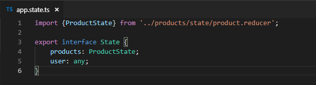

# Simple SVG

## SVG Rectangle

```markup
<svg width="400" height="60">
    <rect x="375" y="0" width="50" height="50" fill="green"></rect>
</svg>
```


## SVG Rectangle with Stroke

```markup
<svg width="400" height="60">
  <rect x="0" y="0" width="50" height="50" fill="green" stroke="grey" stroke-width="5px"></rect>
</svg>
```



## SVG Circle

```markup
<svg width="400" height="60">
  <circle cx="90" cy="25" r="25" fill="red"></circle>
</svg>
```


## SVG Ellipses

```markup
<svg width="400" height="60">
  <ellipse cx="90" cy="25" rx="25" ry="9" fill="red"></ellipse>
</svg>
```


## SVG Lines

```markup
<svg width="400" height="60">
  <line x1="185" y1="5" x2="230" y2="40" stroke="blue" stroke-width="5"></line>
</svg>
```


## SVG Text

```markup
<svg width="400" height="60">
    <text x="260" y="25" font-size="20px" fill="orange">Hello World</text>
</svg>
```


## SVG Path

```markup
<svg width="400" height="160">
  <path d="M10 80 C 40 10, 65 10, 95 80 S 150 150, 180 80" stroke="black" fill="transparent"></path>
</svg>
```


Example: 



