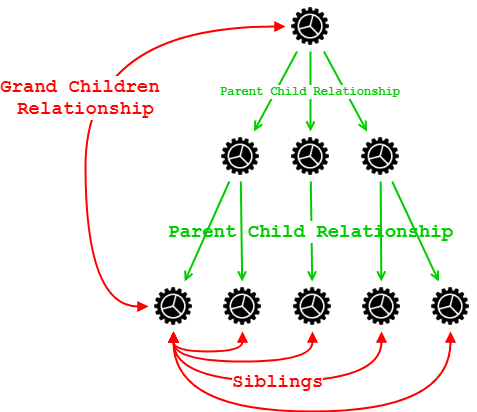

# Sharing Data using Service

 When passing data between components that lack a direct connection like siblings component, grandchildren, grandparent component we can use **shared service**.



We can use  **BehaviorSubject** for sharing data via the service.

### parent.component.ts



```typescript
import { Component, OnInit } from '@angular/core';
import { DataService } from "../app/service/data.service";

@Component({
  selector: 'app-parent',
  template: `
    {{message}}
    <br/><br/>
    <app-sibling></app-sibling>
     <br/><br/>
    <app-sibling></app-sibling>
  `,
})
export class ParentComponent implements OnInit {

  message:string;

  constructor(private data: DataService) { }

  ngOnInit() {
    this.data.currentMessage.subscribe(message => this.message = message)
  }

}
```



### sibling.component.ts



```typescript
import { Component, OnInit } from '@angular/core';
import { DataService } from "../app/service/data.service";

@Component({
  selector: 'app-sibling',
  template: `
    {{message}}
    <button (click)="newMessage()">New Message</button>
  `,
})
export class SiblingComponent implements OnInit {

  message:string;

  constructor(private data: DataService) { }

  ngOnInit() {
    this.data.currentMessage.subscribe(message => this.message = message)
  }

  newMessage() {
    this.data.changeMessage("Hello from Sibling "+Math.round(Math.random()*100000))
  }

}
```



## [Demo](https://stackblitz.com/edit/share-data-btwin-same-siblings)


