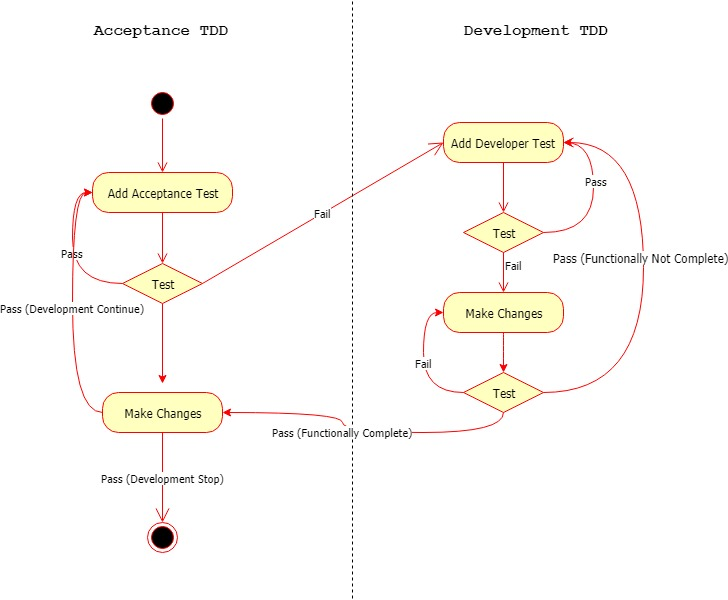

# Test Driven Design

TDD is an important agile requirements and agile design technique.

In normal Testing process, we first generate the code and then test. But in TDD approach we write Test first and let the Test fail. In order to pass the test, the team has to develop and refactors the code. Refactoring a code involves changing some code without affecting its behavior.

There are two levels of TDD.

1. Acceptance TDD \(ATDD\) / Behavior Driven Development \(BDD\)
2. Developer TDD

## Content for TDD in Angular

* [Test Angular Component](test-components/)
  * [Test Methods and Properties in Angular](test-components/verify-methods-and-properties.md)
  * [Injecting Dependencies and DOM Changes in Tests Angular](test-components/injecting-dependencies-and-dom-changes.md)
  * [Testing Asynchronous Action in Angular](test-components/asynchronous-action.md)
* [Test Service](test-services/)
  * [Testing HTTP in Service Using MockBackend Angular](test-services/test-http-in-service-using-mockbackend.md)
  * [Testing HTTP in Service Without MockBackend Angular](test-services/test-http-in-service-without-mockbackend.md)

> As in TDD we write unit test first, we might find a lot of our code is hard to test. **The best strategy is often to refactor code to make it easy to test.** _For example, consider refactoring component code into services and focusing on service tests or vice versa._

